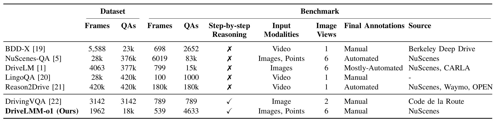
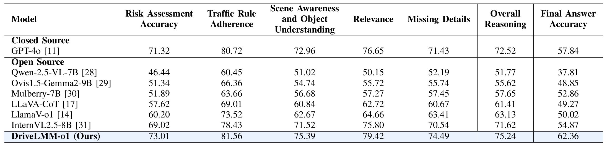

# DriveLMM-o1: A Step-by-Step Reasoning Dataset and Large Multimodal Model for Driving Scenario Understanding

DriveLMM-o1 is a comprehensive framework designed to advance autonomous driving by combining a novel dataset with a large multimodal model. This repository contains the model, dataset, training scripts, and evaluation tools that underpin our work on improving step-by-step reasoning in complex driving scenarios.

---

## Overview

Autonomous driving requires models to not only produce correct final decisions but also to justify those decisions through logical, interpretable reasoning. The DriveLMM-o1 framework addresses this need by:

- **Integrating Multimodal Inputs:** The model leverages multiview images capturing a complete and detailed view of the driving scene.
- **Step-by-Step Reasoning:** Each decision is supported by intermediate reasoning steps, making the model’s output more transparent and explainable.
- **Extensive Dataset and Benchmark:** The DriveLMM-o1 dataset consists of over 18,000 visual question-answer pairs (VQAs) for training and more than 4,000 for testing, with manually curated reasoning annotations covering perception, prediction, and planning, supporting multimodality inputs including multiview images and point clouds.

---

## Dataset

### Description

The DriveLMM-o1 dataset is designed to evaluate the reasoning capabilities of models in autonomous driving. Each example includes:
- **Multimodal Inputs:** High-quality multiview images and LiDAR point clouds.
- **Structured Reasoning:** Detailed annotations with step-by-step explanations that guide the decision-making process.
- **Diverse Scenarios:** A variety of urban and highway scenes to ensure robustness in real-world environments.

### Data Preparation

**NuScenes Data Requirement:**  
To use the DriveLMM-o1 dataset, you must download the images and LiDAR point clouds from the nuScenes trainval set. PYou may obtain **only the keyframes** from the nuScenes trainval split.

For download instructions and licensing details, visit the [nuScenes website](https://www.nuscenes.org).

### Dataset Statistics

Below is an overview of the dataset statistics in comparison to existing datasets:



---

## Benchmark & Comparison

Our benchmark evaluates both the final answer accuracy and the logical consistency of the step-by-step reasoning across various autonomous driving tasks. The following table compares DriveLMM-o1 with several prominent datasets in the autonomous driving domain:



Key metrics have been proposed to assess driving specific reasoning:
- **Risk Assessment Accuracy**
- **Traffic Rule Adherence**
- **Scene Awareness and Object Understanding**
- **Relevance**
- **Missing Details**

DriveLMM-o1 outperforms existing LMMs by providing higher reasoning scores and improved decision accuracy on our proposed benchmark.

---

## Model

### Architecture & Training

The DriveLMM-o1 model is built upon the InternVL2.5-8B architecture and fine-tuned using LoRA (Low-Rank Adaptation). Key components include:

- **Stitched Multiview Images:** Integrates multiple camera perspectives into a single comprehensive representation.
- **Dynamic Image Patching:** Handles high-resolution images efficiently by processing them as tiles.
- **LoRA Finetuning:** Adapts the model efficiently by injecting trainable low-rank matrices into the LLaMA backbone, with only 0.49% of the total parameters being trainable.

### Performance

DriveLMM-o1 demonstrates superior performance in reasoning and final answer accuracy compared to previous open-source models. Its structured reasoning process leads to more reliable and interpretable autonomous driving decisions.

---

## Usage

### Model Usage

You can load the DriveLMM-o1 model using the Hugging Face Transformers library with the following code:

```python
from transformers import AutoModel, AutoTokenizer
import torch

path = 'ayeshaishaq/DriveLMMo1'
model = AutoModel.from_pretrained(
    path,
    torch_dtype=torch.bfloat16,
    low_cpu_mem_usage=True,
    use_flash_attn=True,
    trust_remote_code=True
).eval().cuda()

tokenizer = AutoTokenizer.from_pretrained(
    path,
    trust_remote_code=True,
    use_fast=False
)
```
For detailed usage instructions and additional configurations, please refer to the [OpenGVLab/InternVL2_5-8B](https://huggingface.co/OpenGVLab/InternVL2_5-8B) repository.

### Dataset Usage

After downloading the nuScenes keyframe data (both images and/or LiDAR point clouds), use the relevant preprocessing for your model to integrate the data into your training or inference pipelines.

---

## Hugging Face Links

- **Model on Hugging Face:** [DriveLMM-o1 Model](https://huggingface.co/ayeshaishaq/DriveLMMo1)
- **Dataset on Hugging Face:** [DriveLMM-o1 Dataset](https://huggingface.co/datasets/ayeshaishaq/DriveLMMo1)


